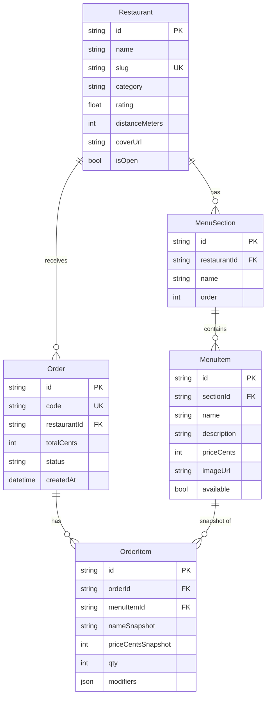

# Arquitetura — Projeto Demo Mandaí (Mentoria)

## Contexto

Este plano define a estrutura inicial de um projeto demo educacional baseado no design handoff `design_handoff_mandai_web/` (sistema de pedidos por pickup "Mandaí"). O foco é **didático**: público da mentoria tem conhecimento básico em tech, então a arquitetura prioriza **clareza > sofisticação**. Aplica o esqueleto de DDD + Clean Architecture de forma enxuta, evitando overhead típico do estilo (múltiplos bounded contexts, Result pattern, mappers explícitos como classes, autenticação federada com rollback transacional).

**Stack confirmado:**
- Frontend: **Next.js 15 (App Router) + TypeScript**
- Backend: **Fastify + TypeScript** com DDD/Clean manual (DI por factory, sem decorators)
- ORM/DB: **Prisma + Neon Postgres**
- Monorepo: pastas `apps/web` e `apps/api` lado a lado (sem turborepo)
- Deploy: **dois projetos Vercel** apontando para o mesmo repo, com Root Directory diferente
- Sem auth no MVP (pode ser adicionada depois como exercício)

---

## 1. Estrutura do repositório

```
mandai-web/
├── README.md
├── .gitignore
├── .nvmrc                              # Node 20 LTS
├── docs/
│   ├── erd.md                          # ERD em Mermaid
│   ├── user-stories.md                 # stories derivadas do handoff
│   └── adr/
│       ├── README.md                   # índice + template
│       └── 0001-*.md, 0002-*.md, ...   # 1 arquivo por decisão
├── design_handoff_mandai_web/          # referência (não tocar)
└── apps/
    ├── web/                            # Next.js 15
    └── api/                            # Fastify
```

**Decisão:** sem `package.json` raiz e sem workspaces. Cada `apps/*` é um projeto npm independente. Motivo didático: o aluno entra em uma pasta, roda `npm install` e `npm run dev`, sem precisar entender workspaces. A Vercel trata cada um como projeto separado, o que casa naturalmente.

---

## 2. Backend — `apps/api/`

### 2.1 Estrutura

```
apps/api/
├── package.json
├── tsconfig.json
├── .env.example                        # DATABASE_URL, PORT
├── vercel.json                         # rota catch-all → função serverless
├── prisma/
│   ├── schema.prisma
│   └── seed.ts                         # popula restaurantes/itens do handoff
└── src/
    ├── server.ts                       # entrypoint local (app.listen)
    ├── app.ts                          # buildApp(): cria Fastify, registra rotas
    ├── api/
    │   └── index.ts                    # handler Vercel (proxy para Fastify)
    ├── modules/
    │   └── ordering/                   # ÚNICO bounded context
    │       ├── domain/
    │       │   ├── entities/
    │       │   │   ├── restaurant.ts
    │       │   │   ├── menu-item.ts
    │       │   │   └── order.ts
    │       │   ├── value-objects/
    │       │   │   └── money.ts        # 1 VO didático
    │       │   └── repositories/
    │       │       ├── restaurant.repository.ts   # interface
    │       │       └── order.repository.ts        # interface
    │       ├── application/
    │       │   └── use-cases/
    │       │       ├── list-restaurants.ts
    │       │       ├── get-restaurant.ts
    │       │       ├── search.ts
    │       │       ├── create-order.ts
    │       │       └── get-order.ts
    │       ├── infra/
    │       │   ├── prisma-restaurant.repository.ts
    │       │   └── prisma-order.repository.ts
    │       ├── http/
    │       │   └── ordering.routes.ts             # Fastify plugin
    │       └── ordering.module.ts                 # factory de DI manual
    └── shared/
        ├── prisma.ts                              # singleton PrismaClient
        └── errors.ts                              # HttpError + handler global
```

### 2.2 Camadas (Clean Architecture mínima)

- **Domain** — Tipos e classes puras (sem imports de Fastify/Prisma). Entidade `Restaurant` com regras; VO `Money` (valida valor ≥ 0, formata BRL); interfaces de repositório como **contratos**.
- **Application** — Use cases são classes simples com método `execute(input)`. Cada use case recebe as dependências (repos) pelo construtor. Lançam exceções `HttpError` em caso de erro (404, 400). Sem Result pattern.
- **Infra** — Implementação concreta dos repositórios usando `PrismaClient`. Faz o map Prisma → Domain inline no método (sem classe `Mapper` separada — basta uma função `toDomain()` no fim do arquivo).
- **HTTP (Presentation)** — `ordering.routes.ts` é um **plugin Fastify** que recebe os use cases já instanciados e expõe os endpoints. Validação de payload com `zod` + `fastify-type-provider-zod`.

### 2.3 Injeção de dependência manual (didático)

Em `ordering.module.ts`:

```ts
export function buildOrderingModule(prisma: PrismaClient) {
  const restaurantRepo = new PrismaRestaurantRepository(prisma);
  const orderRepo = new PrismaOrderRepository(prisma);

  return {
    listRestaurants: new ListRestaurantsUseCase(restaurantRepo),
    getRestaurant: new GetRestaurantUseCase(restaurantRepo),
    search: new SearchUseCase(restaurantRepo),
    createOrder: new CreateOrderUseCase(orderRepo, restaurantRepo),
    getOrder: new GetOrderUseCase(orderRepo),
  };
}
```

Em `app.ts`, `buildApp()` instancia o módulo e passa para o plugin de rotas. **Motivo didático:** o aluno vê o "wire-up" explícito — sem mágica de decorators, fica óbvio quem depende de quem.

### 2.4 Endpoints (REST simples)

| Método | Path | Use case |
|---|---|---|
| GET | `/api/restaurants` | listRestaurants (com filtro `?category=`) |
| GET | `/api/restaurants/:id` | getRestaurant |
| GET | `/api/search?q=` | search |
| POST | `/api/orders` | createOrder |
| GET | `/api/orders/:id` | getOrder |

---

## 3. Frontend — `apps/web/`

### 3.1 Estrutura

```
apps/web/
├── package.json
├── next.config.ts                      # remotePatterns para Unsplash
├── tsconfig.json
├── .env.example                        # NEXT_PUBLIC_API_BASE_URL
├── public/
│   └── assets/                         # copiado do handoff (logos, glyphs, illustrations)
└── src/
    ├── app/
    │   ├── layout.tsx                  # AppHeader + AppFooter + Providers
    │   ├── page.tsx                    # Home
    │   ├── categoria/[slug]/page.tsx
    │   ├── restaurante/[id]/page.tsx
    │   ├── busca/page.tsx
    │   ├── sacola/page.tsx
    │   ├── confirmacao/[orderId]/page.tsx
    │   ├── globals.css                 # importa tokens.css + app.css
    │   └── providers.tsx               # QueryClientProvider + CartProvider
    ├── modules/
    │   ├── restaurants/
    │   │   ├── components/             # RestaurantCard, CategoryGrid, ...
    │   │   ├── hooks/
    │   │   │   ├── keys.ts             # query keys factory
    │   │   │   ├── useRestaurants.ts
    │   │   │   └── useRestaurant.ts
    │   │   ├── services/
    │   │   │   └── restaurants.api.ts  # fetch wrappers
    │   │   └── types.ts
    │   ├── cart/
    │   │   ├── components/             # CartSidebar, CartItem, AddItemModal
    │   │   ├── context.tsx             # CartContext + reducer + localStorage sync
    │   │   └── types.ts
    │   └── orders/
    │       ├── hooks/useCreateOrder.ts
    │       └── services/orders.api.ts
    ├── shared/
    │   ├── components/                 # AppHeader, AppFooter, Icon (lucide-react)
    │   ├── lib/
    │   │   └── api.ts                  # fetch wrapper base (lê NEXT_PUBLIC_API_BASE_URL)
    │   └── types.ts
    └── styles/
        ├── tokens.css                  # copiado do handoff
        └── app.css                     # copiado do handoff
```

### 3.2 Padrões

- **Organização feature-based**: cada módulo agrupa pages-relevantes, components, hooks, services, types.
- **Server Components por padrão** para as páginas de listagem (`page.tsx` chama `fetch()` direto). Componentes interativos (sacola, modal de adicionar item) viram **Client Components** com `'use client'`.
- **TanStack Query** apenas no client-side para mutations e dados que dependem do estado da sacola/usuário.
- **Sacola**: `CartContext` (React Context + `useReducer`) com sincronização para `localStorage` no client. Sem Zustand.
- **Ícones**: trocar o `Icon` inline do handoff por `lucide-react`.
- **Imagens**: `next/image` com `remotePatterns` para `images.unsplash.com`.

### 3.3 Reuso do design handoff

- Copiar `styles/tokens.css` e `styles/app.css` direto para `apps/web/src/styles/` — funcionam quase como estão. Importar em `app/globals.css`.
- Copiar assets de `design_handoff_mandai_web/assets/` para `apps/web/public/assets/`.
- Recriar `AppHeader` e `AppFooter` em `shared/components/` baseados em `shared.jsx`, trocando ícones inline por `lucide-react`.
- Cada `screen-*.jsx` vira a `page.tsx` correspondente em App Router; o JSX é amplamente reaproveitável (só remove `function Foo()` e adapta para client/server).

---

## 4. Banco de dados — Prisma + Neon

### 4.1 Schema mínimo (`prisma/schema.prisma`)

Modelos essenciais para suportar as telas:

- `Restaurant` — id, name, slug, category, rating, distanceMeters, coverUrl, isOpen
- `MenuSection` — id, restaurantId, name, order
- `MenuItem` — id, sectionId, name, description, priceCents, imageUrl, available
- `Order` — id, code (`MA-XXXX`), restaurantId, totalCents, status, createdAt
- `OrderItem` — id, orderId, menuItemId, nameSnapshot, priceCentsSnapshot, qty, modifiersJson

**Decisão:** `modifiers` como JSON em `OrderItem` para evitar 3 tabelas extras. Snapshot de nome/preço para o pedido sobreviver a mudanças no cardápio.

### 4.2 Seed

`prisma/seed.ts` popula 6-8 restaurantes e ~30 itens espelhando as categorias do handoff (pizza, hambúrguer, japonesa, etc.), com URLs de Unsplash reais.

### 4.3 Neon + Vercel

- Criar projeto no Neon (free tier).
- Conectar ao projeto Vercel da API via integração Neon ↔ Vercel (1 clique): popula `DATABASE_URL` automaticamente.
- Para dev local, mesmo `DATABASE_URL` apontando para o Neon (ou branch de dev no Neon).

---

## 5. Deploy Vercel

### 5.1 Dois projetos, um repo

Na Vercel, criar **dois projetos** apontando para o mesmo repositório GitHub:

| Projeto | Root Directory | Framework Preset |
|---|---|---|
| `mandai-web` | `apps/web` | Next.js (auto) |
| `mandai-api` | `apps/api` | Other |

### 5.2 `apps/api/vercel.json`

Roteia toda request `/api/*` para uma function única que delega ao Fastify:

```json
{
  "rewrites": [{ "source": "/(.*)", "destination": "/api" }],
  "functions": { "src/api/index.ts": { "maxDuration": 10 } }
}
```

E `src/api/index.ts` mantém um Fastify singleton entre invocações (warm starts):

```ts
import { buildApp } from '../app';
let appPromise: ReturnType<typeof buildApp> | null = null;

export default async function handler(req, res) {
  if (!appPromise) appPromise = buildApp();
  const app = await appPromise;
  await app.ready();
  app.server.emit('request', req, res);
}
```

### 5.3 Env vars

- `apps/web`: `NEXT_PUBLIC_API_BASE_URL` (URL do projeto da API na Vercel; localmente `http://localhost:3001`).
- `apps/api`: `DATABASE_URL` (Neon).

---

## 6. Documentação do projeto

Toda documentação de produto/arquitetura vive em `docs/` na raiz do repositório.

### 6.1 ERD — `docs/erd.md`

Diagrama de entidades e relacionamentos em **Mermaid** (`erDiagram`). Reflete o `schema.prisma` da API mas vive como documento de domínio independente — fonte de discussão antes de mexer no schema. Renderiza nativamente no GitHub.

Esboço a partir do schema da seção 4.1:

````markdown

````

**Regra de manutenção:** PR que altera `schema.prisma` também altera `docs/erd.md` no mesmo commit.

### 6.2 ADRs — `docs/adr/`

Architecture Decision Records: registro histórico vivo das decisões. Cada decisão é **um arquivo Markdown numerado e imutável** — quando uma decisão muda, cria-se um novo ADR que supera o anterior (campo `Status: Superseded by ADR-NNNN`).

`docs/adr/README.md` contém o índice de todos os ADRs + o template:

```markdown
# ADR-NNNN: <título curto>

- **Status:** Accepted | Superseded by ADR-XXXX | Deprecated
- **Data:** YYYY-MM-DD

## Contexto
Qual problema ou força levou a esta decisão?

## Decisão
O que foi decidido, em frases curtas e diretas.

## Consequências
O que isso facilita, dificulta, ou compromete a manter.

## Alternativas consideradas
Outras opções e o motivo de cada uma ter sido descartada.
```

**ADRs iniciais a criar** (podem ir todos no commit inicial):

| Nº | Título | Resumo |
|---|---|---|
| 0001 | Monorepo com pastas `apps/*` sem workspaces | Simplicidade didática acima de ergonomia avançada |
| 0002 | Fastify + DDD manual no backend | Camadas explícitas, DI sem mágica, Vercel-friendly |
| 0003 | Next.js 15 App Router no frontend | Vercel-native, `next/image`, Server Components |
| 0004 | Prisma + Neon Postgres | ORM popular + Postgres serverless integrado à Vercel |
| 0005 | DDD/Clean enxuto com 1 bounded context | Evita explosão de pastas no demo |
| 0006 | Sem autenticação no MVP | Foco em arquitetura; auth fica como extensão |
| 0007 | Documentação em `docs/` (ERD, ADR, User Stories) | Padroniza onde o "porquê" do projeto vive |

### 6.3 User Stories — `docs/user-stories.md`

Lista mínima derivada das telas do handoff, formato "Como X, quero Y, para Z". Sem critérios de aceite detalhados, sem points — o objetivo é mapear escopo para a conversa na mentoria.

Stories a registrar:

- **US-01** Descobrir restaurantes — Como cliente, quero ver restaurantes próximos na Home, para escolher onde pedir.
- **US-02** Filtrar por categoria — Como cliente, quero filtrar restaurantes por tipo de cozinha, para encontrar o que estou afim.
- **US-03** Buscar — Como cliente, quero buscar por nome de restaurante ou prato, para localizar rapidamente.
- **US-04** Ver cardápio — Como cliente, quero ver o cardápio de um restaurante com seções e fotos, para escolher um item.
- **US-05** Customizar item — Como cliente, quero escolher acompanhamentos, adicionais e adicionar observações ao pedir, para personalizar.
- **US-06** Gerenciar sacola — Como cliente, quero ajustar quantidade, remover itens e ver o total, antes de finalizar.
- **US-07** Aplicar cupom — Como cliente, quero usar um código de cupom, para receber desconto. *(opcional no MVP)*
- **US-08** Finalizar e receber código — Como cliente, quero confirmar o pedido e receber um código `MA-XXXX` + QR, para apresentar no balcão.
- **US-09** Lidar com estados de erro — Como cliente, quero ver mensagem clara em restaurante fechado, item esgotado, busca sem resultados ou erro técnico.
- **US-10** Trocar de restaurante com sacola — Como cliente, quero ser avisado ao mudar de restaurante com itens na sacola, para não perder a seleção. *(opcional no MVP)*

---

## 7. Setup inicial (passos para criar o repositório)

Executar uma vez para bootstrap:

1. `git init mandai-web && cd mandai-web`
2. Criar `apps/web` com `npx create-next-app@latest apps/web --typescript --app --no-tailwind --eslint`
3. Criar `apps/api` manualmente: `mkdir -p apps/api/src && cd apps/api && npm init -y && npm i fastify @fastify/cors zod fastify-type-provider-zod @prisma/client && npm i -D typescript tsx @types/node prisma`
4. `npx prisma init --datasource-provider postgresql` em `apps/api`
5. Copiar `styles/`, `assets/`, e adaptar `shared.jsx` + telas para `apps/web/src/`
6. Configurar `next.config.ts` (`remotePatterns` Unsplash) e `vercel.json` em `apps/api`
7. Criar projeto Neon e conectar à API Vercel
8. Criar `docs/erd.md`, `docs/user-stories.md` e ADRs iniciais (`docs/adr/0001-*.md` a `0007-*.md` conforme seção 6)
9. Commitar e criar 2 projetos na Vercel apontando para o repo com Root Directory diferente

---

## 8. Considerações didáticas

- **Ordem sugerida de apresentação na mentoria:** monorepo → Prisma schema → backend domain (entidades + interfaces) → use cases → infra (Prisma repos) → HTTP routes → frontend (App Router) → integração via TanStack Query → deploy Vercel.
- **Conceitos-âncora:** "interface no domínio, implementação na infra" (inversão de dependência), "use case = um caso de uso da aplicação", "Server Component vs Client Component".
- **Armadilhas a evitar na fala:** não introduzir Result pattern, eventos de domínio, CQRS, ou múltiplos bounded contexts. Manter exceções padrão.
- **Extensões pós-MVP** (se sobrar tempo na mentoria): adicionar 1 value object a mais (`Cpf`), introduzir auth simples com JWT, paginação, testes unitários de use case com repo fake.

---

## 9. Arquivos a serem criados (lista crítica)

**Backend:**
- `apps/api/package.json`, `tsconfig.json`, `.env.example`, `vercel.json`
- `apps/api/prisma/schema.prisma`, `prisma/seed.ts`
- `apps/api/src/app.ts`, `src/server.ts`, `src/api/index.ts`
- `apps/api/src/shared/prisma.ts`, `src/shared/errors.ts`
- `apps/api/src/modules/ordering/` (estrutura completa de 4 camadas, ~12 arquivos)

**Frontend:**
- `apps/web/` scaffold do `create-next-app`
- `apps/web/src/styles/tokens.css`, `app.css` (copiados do handoff)
- `apps/web/src/app/layout.tsx`, `providers.tsx`, `globals.css`
- `apps/web/src/app/{,categoria/[slug]/,restaurante/[id]/,busca/,sacola/,confirmacao/[orderId]/}page.tsx`
- `apps/web/src/shared/components/{AppHeader,AppFooter,Icon}.tsx`
- `apps/web/src/shared/lib/api.ts`
- `apps/web/src/modules/{restaurants,cart,orders}/` (services, hooks, components, types)
- `apps/web/public/assets/` (logos, glyphs, illustrations do handoff)

**Documentação (`docs/`):**
- `docs/erd.md` (diagrama Mermaid `erDiagram` espelhando o schema Prisma)
- `docs/user-stories.md` (US-01 a US-10 conforme seção 6.3)
- `docs/adr/README.md` (índice + template ADR)
- `docs/adr/0001-monorepo-sem-workspaces.md` até `0007-docs-em-docs-folder.md` (um arquivo por decisão da tabela na seção 6.2)

**Raiz:**
- `README.md` (visão geral + instruções de setup local e deploy + links para `docs/`)
- `.gitignore`, `.nvmrc`

---

## 10. Verificação

Como validar que a estrutura está funcionando end-to-end:

1. **Local — Backend:** `cd apps/api && npm run dev` → `curl http://localhost:3001/api/restaurants` retorna lista do seed.
2. **Local — Frontend:** `cd apps/web && npm run dev` → http://localhost:3000 mostra Home com restaurantes do backend local.
3. **Fluxo crítico local:** Home → escolher restaurante → adicionar item → ir para sacola → finalizar → tela de confirmação com código `MA-XXXX`.
4. **Build:** `npm run build` em cada `apps/*` sem erros de tipo.
5. **Deploy:** push para GitHub → 2 projetos Vercel buildam verde → URL pública da web consome URL pública da api.

---

## 11. O que NÃO está neste plano (escopo explícito)

- Autenticação/login (handoff tem tela de login v2 — fica fora do MVP).
- Pagamento (Mandaí é pickup, paga na hora — fora do MVP).
- Responsividade mobile (handoff é desktop-only).
- i18n, dark mode, acessibilidade WCAG.
- Testes E2E (Playwright/Cypress). Testes unitários de use case são opcionais.
- Observabilidade (logs estruturados, tracing).
- CI/CD além do deploy automático da Vercel.

Cada um desses é candidato natural a "exercício extra" para os mentees.
