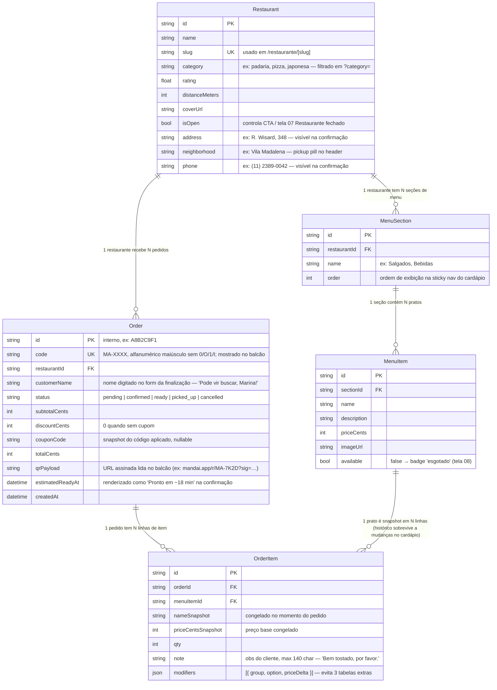

# ERD — Mandaí

Diagrama de entidades e relacionamentos do bounded context `ordering`. Fonte de discussão de domínio: vive em paralelo ao `apps/api/prisma/schema.prisma` e deve ser atualizado **no mesmo commit** que altera o schema (regra do ARQUITETURA.md §6.1).

> **Fonte canônica do diagrama: [`erd.mmd`](./erd.mmd).** Este `.md` espelha o `.mmd` numa fence ```mermaid pra renderizar nativamente no GitHub e carregar as notas de modelagem em prosa. Ao editar, altere os dois no mesmo commit (ou só o `.mmd` e regenere o bloco abaixo).



## Notas de modelagem

- **Snapshots em `OrderItem`** (`nameSnapshot`, `priceCentsSnapshot`, `modifiers`): o pedido precisa sobreviver a mudanças posteriores no cardápio (renomeação, reprecificação, desativação). A FK para `MenuItem` permanece para rastreabilidade, mas a verdade do que foi pedido fica no próprio `OrderItem`.
- **`modifiers` como JSON**, não 3 tabelas (`ModifierGroup`, `Modifier`, `OrderItemModifier`): didaticamente o trade-off vale — a estrutura `{ group, option, priceDelta }[]` já cobre o que as telas mostram ("Acompanha: mel da casa", "+ Queijo coalho extra"), espelha o tipo `CartItem` do handoff e mantém o schema enxuto. Custo: não dá pra agregar "qual adicional é mais pedido" via SQL puro — aceito no MVP.
- **Sem tabela `Category`**: a §4.1 trata categoria como string em `Restaurant` e a filtragem é por `?category=`. As 8 categorias da Home podem ser uma constante no frontend; promover a tabela só se virar entidade com regra própria (descrição, ícone configurável, ordering global).
- **Sem tabela `Coupon`**: cupom é opcional no MVP (US-07). `Order.couponCode` + `Order.discountCents` guardam o snapshot — suficiente pra renderizar "Cupom MANDA20 − R$ 12,96" na confirmação. Se um catálogo de cupons surgir depois, vira tabela própria com FK opcional.
- **Sacola é mono-restaurante**: a regra ("limpar sacola e começar de novo?") vive no frontend (`CartContext` + localStorage); o backend só registra o pedido finalizado, então `Order` já tem `restaurantId` sem ambiguidade. Não há entidade `Cart` persistida.
- **`Order.status` como string**: a §4.1 deixa string; valores prováveis (`pending` → `confirmed` → `ready` → `picked_up`, mais `cancelled`) ficam documentados aqui até virarem enum Prisma se a necessidade aparecer.
- **`Order.qrPayload`**: o QR do mock é decorativo (`QrCodePattern`); em produção o backend gera o payload (URL assinada) e o frontend renderiza com `qrcode.react`. Por isso o payload mora em `Order`, não é derivado só de `code`.
